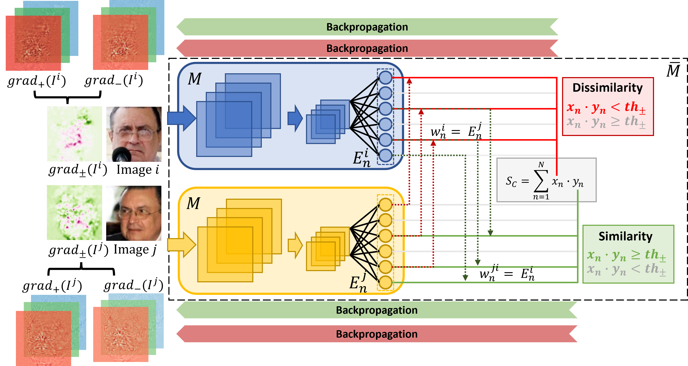

# xSSAB - Efficient Explainable Face Verification based on Similarity Score Argument Backpropagation

Official repository of the paper: 

**Efficient Explainable Face Verification based on Similarity Score Argument Backpropagation,**  
*Marco Huber, Anh Thi Luu, Philipp Terhörst, Naser Damer*  
Fraunhofer IGD, TU Darmstadt

Pre-print on arxiv: TODO



NOTE: The original codes are implemented on a private codebase and will not be released. This repo is an official but abridged version. The code/models for x_face can be retrieved [here](https://github.com/Martlgap/x-face-verification) and the code for xCos [here](https://github.com/ntubiolin/xcos).

### Getting started:
1. Load pre-trained models in folder *./models*
2. Install environment
```commandline
pip install -r requirements.txt
```

## HOW TO RUN
Follow steps in order: *Methodology* -> *Patches* -> *Evaluation*

### Methodology
1. Specify model and data paths [here](methodology/methodology.py)
   1. ``MODELPATH``: path to model
   2. ``MODELNAME``: name of model
   3. ``SRC_PATH_GRAD``: path to dataset for which gradients should be computed
2. Set variable ``PATCHED_IMGS`` in *methodology.methodology.py*
   1. Set ``PATCHED_IMGS = False`` for running methodology with LFW
   2. Set ``PATCHED_IMGS = True`` for running methodology with PatchLFW
3. In main folder, run ``python3 main.py -s methology_main``

### Patches
1. Patch creation
   1. Specify image data path [here](patches/patch.py)
      1. ``SRC_PATH``: path to LFW
   2. Run ``python3 main.py -s create_patches``
2. Patch evaluation
   1. Specify model and data paths [here](patches/patch_eval.py)
      1. ``MODEL_PATH``: path to model
      2. ``MODELNAME``: name of model
      3. ``PATH_THR``: path to threshold of model on LFW
      4. ``PATH_ORIGINAL_COS``: path to cosine similarity file of model on LFW
      5. ``SRC_PATH_IMG``: path to PatchLFW
   2. Run ``python3 main.py -s evaluate_patches``
FMR and FNMR of patched images will be printed out to the console.

### Evaluation
1. Compute cosine similarity and gradients for patched image pairs
   1. Specify datapaths for patched_imgs [here](methodology/methodology.py)
      1. ``MODELPATH``: path to model
      2. ``MODELNAME``: name of model
      3. ``SRC_PATH_GRAD``: path to dataset for which gradients should be computed
   2. Set ``PATCHED_IMGS = True`` in *methology/methology.py*
   3. Run ``python3 main.py -s methology_patches``
2. Replace pixel in patched image pairs
   1. Specify strategy, percentage, datapaths for patched_imgs [here](evaluation/replacement.py)
      1. ``replace_strategy``: best_worst or random
      2. ``MODELNAME``: name of model
      3. ``PATH_THR``: path to threshold of model on LFW
      4. ``PATH_ORIGINAL_IMGS``: path to LFW
      5. ``PATH_PATCHED_IMGS``: path to PatchLFW
   2. Run ``python3 main.py -s replace_pixel``
3. Compute cosine similarity for patched image pairs with replaced pixels
   1. Specify SRC_PATH_GRAD and DEST_PATH_COS for patched images with replacement [here](methodology/methodology.py)
      1. ``MODELPATH``: path to model
      2. ``MODELNAME``: name of model
   2. If not yet, set ``PATCHED_IMGS = True`` in *methology/methology.py*
   3. Run ``python3 main.py -s methology_replacement``
4. Plot FMR and FNMR 
   1. Specify replacement percentages, strategies, metrics and modelname [here](evaluation/evaluate.py)
      1. ``strategies``: best_worst and/or random
      2. ``APPROACHES``: gradient (for xSSAB)
      3. ``MODELNAMES``: names of models that should be evaluated
   2. Run ``python3 main.py -s evaluate_model_explainability``


## Citation

